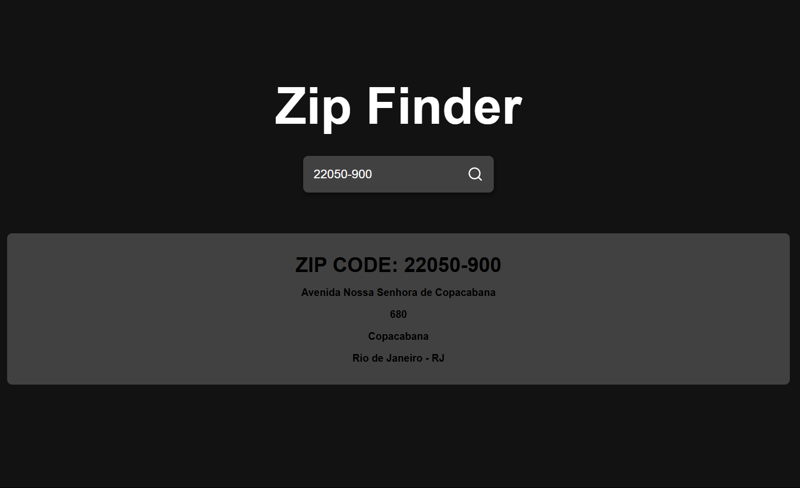

all icons are of react icons

api https://viacep.com.br/ws/01310930/json/

# zip code finder
App React + Vite



# How to using
1. Type name the zip code

# Setup

## Clonando o Repositório

Para começar a trabalhar neste projeto, siga as etapas abaixo:

1. **Clone o repositório:**

   Abra o terminal ou prompt de comando e execute o seguinte comando para clonar o repositório:

   ```bash
   git clone https://github.com/jefersonprimer/zip-code-finder.git

2. **Acesse o diretório do projeto**
    ```bash
   cd zip-code-finder

3. **Instalando as Dependências do Projeto**
      ```bash
   npm install

4. **Abra o projeto no VS Code**
      ```bash
   code .

> **⚠️ AVISO:**  
> Antes de continuar, verifique se você tem o Node.js<br/>
> Certifique-se de consultar se foi instalado corretamente.
> 

1. **Instalar o Node.js**  
Se você ainda não tem o Node.js instalado, acesse o site oficial do <a href="https://nodejs.org/pt" target="_blank" style="color: blue;">Node.js</a> e baixe a versão mais recente.
